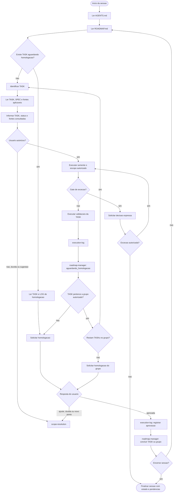
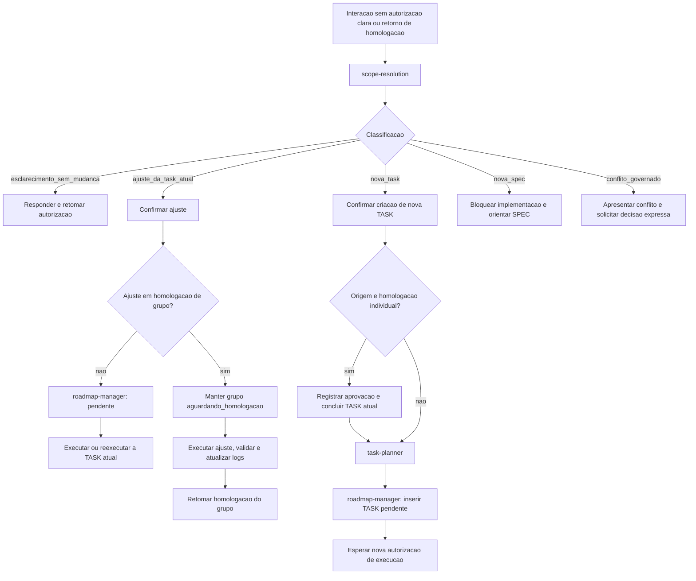
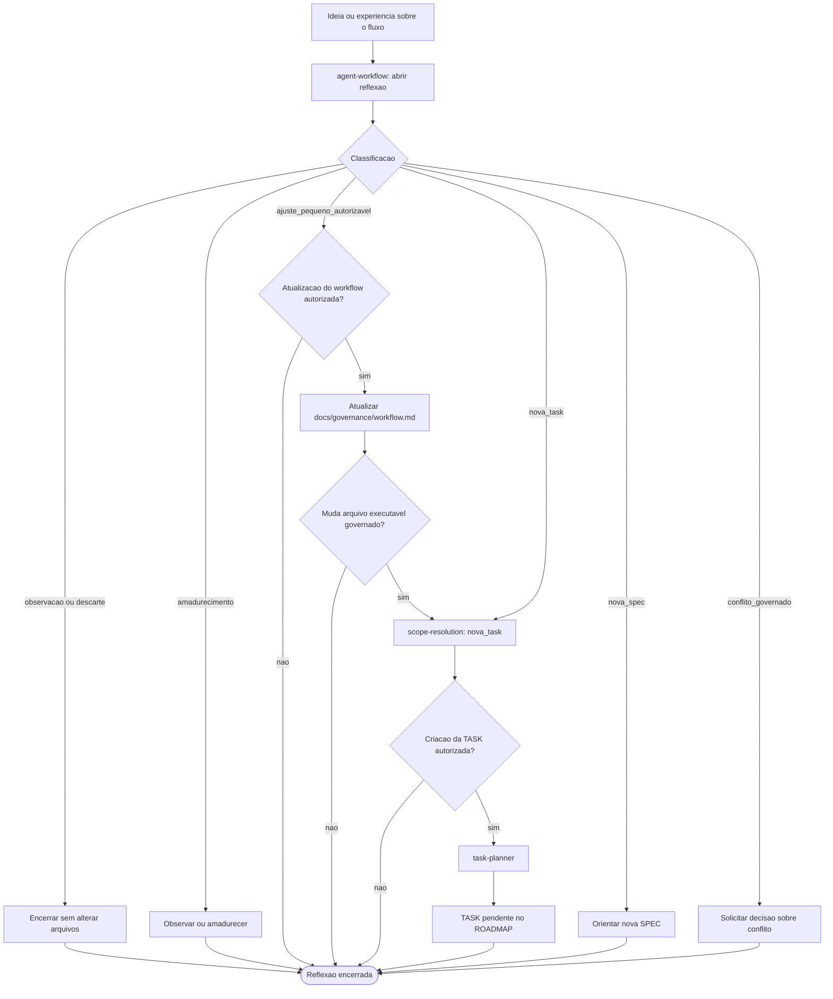

# Workflow

## 1. Arquivos Governados

| Grupo | Arquivos atuais | Funcao no fluxo |
| --- | --- | --- |
| Workflow | `docs/governance/workflow.md` | Mapa vigente da operacao usuario-agente. |
| Orquestracao | `AGENTS.md` | Instrucoes executaveis da sessao e dos gates. |
| Skills | `.agents/skills/*/SKILL.md` | Comportamentos especializados acionados pelo fluxo. |
| Produto | `docs/product/PRD.md` | Requisitos e limites do produto. |
| Arquitetura | `docs/architecture/architecture.md`, `docs/architecture/layer-boundaries.md` | Estrutura tecnica e fronteiras de camadas. |
| Especificacoes | `specs/README.md`, `specs/SPEC-*.md` | Contratos tecnicos que sustentam TASKs. |
| Frontend | `docs/frontend/DESIGN_TOKENS.md`, `docs/frontend/UI_COMPONENT_RULES.md`, `docs/frontend/SCREEN_PATTERNS.md`, `frontend/src/styles/globals.css` | Contrato visual e de interface. |
| Metodologia | `docs/methodology/*.md`, `backend/app/assets/reference/*`, `backend/app/assets/methodology/*` | Fontes, contratos e assets metodologicos. |
| Manuais normativos | `docs/reference/manual-plr-capag-ecd-pgfn-v2.md`, `docs/reference/manual-motor-operacional-universal-ebitda.md` | Referencias metodologicas governadas. |
| Planejamento | `tasks/README.md`, `tasks/TASK-*.md` | Escopo executavel e criterios de aceite. |
| Controle | `ROADMAP.md` | Proxima TASK e status da execucao. |
| Evidencia | `logs/LOG-*.md` | Registro objetivo de execucao, validacao e homologacao. |
| Orientacao | `README.md`, `backend/README.md`, `frontend/README.md`, `backend/app/assets/README.md` | Entrada e orientacao operacional do repositorio. |

## 2. Fluxo Operacional Atual

## 3. Escopo E Homologacao

## 4. Evolucao Do Workflow

